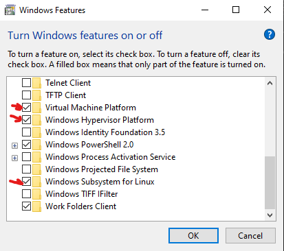

## Installing WSL2 with GUI Support

1. Start by installing Windows Subsystem for Linux (WSL2) by following the official Microsoft documentation: [WSL Installation Guide](https://docs.microsoft.com/en-us/windows/wsl/install-win10)

2. Activate the Windows Subsystem for Linux (WSL2) feature:
   - Search for "Turn Windows features on or off" in the Windows search bar and select the first result.
   - Scroll down to "Windows Subsystem for Linux" and check the box next to it.
   - Click "OK" and restart your computer.
   
2. Open PowerShell as an administrator to install a Linux OS:
   - Search for "PowerShell" in the Windows search bar and select "Run as administrator".
   - Execute the following command in the PowerShell window:
     ```powershell
     wsl --install -d Ubuntu-20.04
     ```
     Note: Replace "Ubuntu-20.04" with the desired Linux distribution from the available list.

3. Set WSL2 as the default version:
   - In the same PowerShell window, run the following command:
     ```powershell
     wsl --set-default-version 2
     ```

4. Configure GUI support for Linux applications in WSL2:
   - Update your GPU driver to the latest version that supports vGPU:
     - For NVIDIA GPUs: Visit [NVIDIA Driver Downloads](https://www.nvidia.com/Download/index.aspx?lang=en-us)
     - For AMD GPUs: Visit [AMD Driver Downloads](https://www.amd.com/en/support)
     - For Intel GPUs: Visit [Intel Driver Downloads](https://www.intel.com/content/www/us/en/download/19344/intel-graphics-windows-dch-drivers.html)
   - Update the WSL2 kernel by running the following command in PowerShell:
     ```powershell
     wsl --update
     ```

5. Test GUI support by opening the gedit text editor:
   - Launch WSL2 from the search bar or by running `wsl` in PowerShell.
   - Install the `gedit` text editor using the package manager:
     ```shell
     sudo apt install gedit
     ```
   - Export the display to the host machine:
     ```shell
     export DISPLAY=:0
     ```
   - Run the text editor:
     ```shell
     gedit
     ```

Make sure to follow each step carefully, and if you encounter any issues, refer to the provided documentation or seek further assistance.