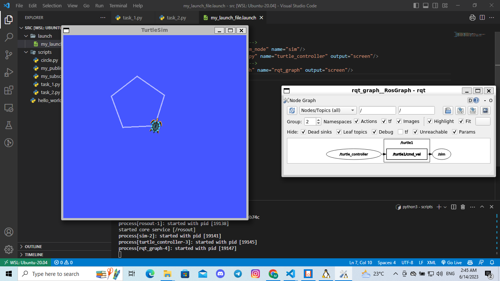
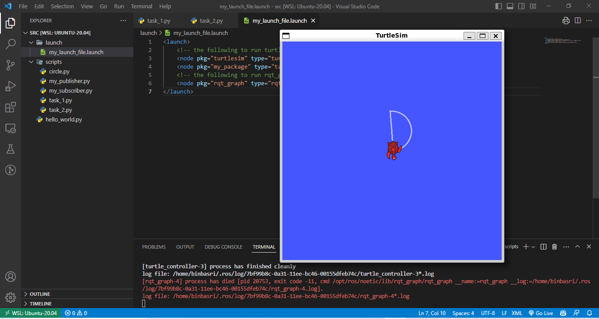

# ROS Challenge: Drawing Shapes with Turtlesim

In this challenge, you will write Python code to control the turtlesim and draw different shapes such as a semi-circle, pentagon, and octagon. 

## Prerequisites

Before we begin, make sure you have ROS installed and turtlesim package available. If not, you can install it by running the following commands:

```bash
pip install rospkg      # Install ROS Python package
apt-get install ros-noetic-ros-tutorials    # Install ROS tutorials package (replace 'noetic' with your ROS version if different)
```


## code template

- use the following code template to get started:

```python
#!/usr/bin/env python3

import rospy
from geometry_msgs.msg import Twist

def draw_shapes():
    rospy.init_node('shape_drawer')
    pub = rospy.Publisher('/turtle1/cmd_vel', Twist, queue_size=10)
    rate = rospy.Rate(2)  # 2 Hz

    # Write your code here to draw shapes
    # Use the pub.publish(twist) command to control the turtle's movement

    rospy.spin()

if __name__ == '__main__':
    try:
        draw_shapes()
    except rospy.ROSInterruptException:
        pass
```


## Task 1: Draw a polygon

In this task, you will write Python code to draw a polygon using the turtlesim.




## Task 2: Draw a Semi-Circle

In this task, you will write Python code to draw a semi-circle using the turtlesim.

