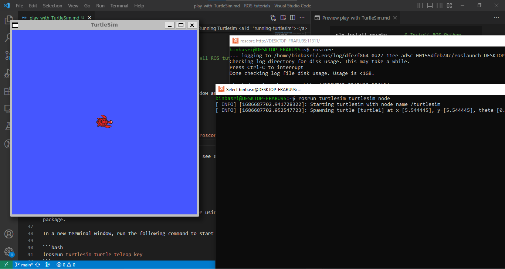
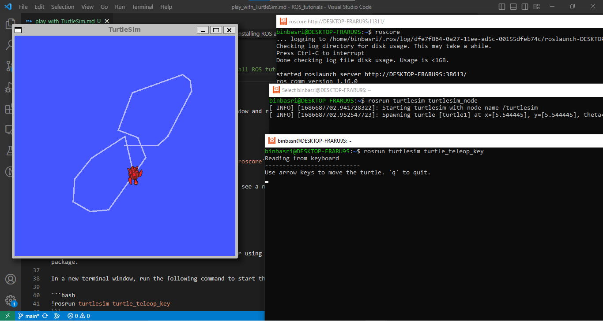
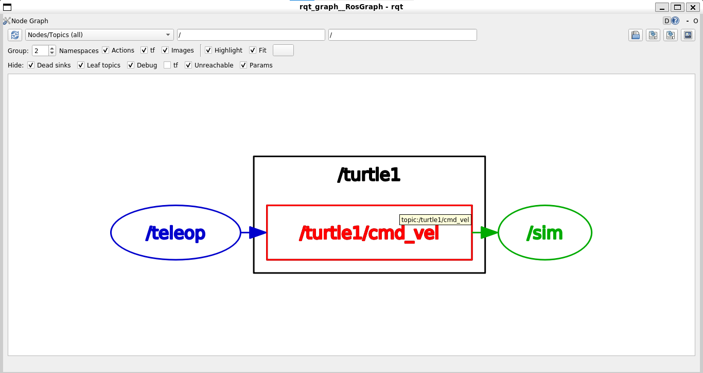

# Introduction to ROS: Controlling Turtlesim

In this tutorial, we will learn how to run the turtlesim simulator and control it using both teleop and Python. 

## Table of Contents

1. [Installing ROS and Turtlesim](#installing-ros-and-turtlesim)
2. [Running Turtlesim](#running-turtlesim)
3. [Controlling Turtlesim using Teleop](#controlling-turtlesim-using-teleop)
4. [Controlling Turtlesim using Python](#controlling-turtlesim-using-python)

## 1. Installing ROS and Turtlesim <a id="installing-ros-and-turtlesim"></a>

##### What is TurtleSim?

TurtleSim is a simple simulator that mimics the behavior of a turtle. It is a good tool for learning the basics of ROS and the `rospy` package.
 
First, let's install the turtlesim package if they are not already installed.

```bash
sudo apt-get install ros-noetic-ros-tutorials    # Install ROS tutorials package
sudo apt-get install ros-noetic-turtlesim        # Install Turtlesim package
```

## 2. Running Turtlesim <a id="running-turtlesim"></a>

To run the turtlesim simulator, open a new terminal window and run the following command:

```bash
rosrun turtlesim turtlesim_node
```
- you first need to run the ROS master node using the `roscore` command in a new terminal window.

This will start the turtlesim simulator, and you should see a new window with a turtle and a rectangular grid.



## 3. Controlling Turtlesim using Teleop <a id="controlling-turtlesim-using-teleop"></a>

Now, let's control the turtle in the turtlesim simulator using the teleop package.

In a new terminal window, run the following command to start the teleop node:

```bash
rosrun turtlesim turtle_teleop_key
```

You can now control the turtle using the arrow keys on your keyboard. Experiment with different key combinations to move the turtle in different directions.



## 4. Controlling Turtlesim using Python <a id="controlling-turtlesim-using-python"></a>

If you see the rqt_graph, you will notice that the teleop node publishes velocity commands to the `/turtle1/cmd_vel` topic. that means we can also control the turtle if we publish velocity commands to the same topic.



But first we need to understand that topic and what kind of messages it expects. To do that, we can use the `rostopic` command-line tool to get more information about the topic:

```bash
rostopic info /turtle1/cmd_vel
```

The output should look something like this:

```bash
Type: geometry_msgs/Twist

Publishers:
 * /teleop_turtle (http://ubuntu:37635/)
```

This tells us that the `/turtle1/cmd_vel` topic expects messages of type `geometry_msgs/Twist`. You can also see that the teleop node is publishing to this topic.

Now, let's see what kind of messages the teleop node is publishing to the `/turtle1/cmd_vel` topic. To do that, we can use the `rostopic echo` command-line tool:

```bash
rostopic echo /turtle1/cmd_vel
```

Or to check the structure of the message, we can use the `rosmsg show` command-line tool:

```bash
rosmsg show geometry_msgs/Twist
```

The output should look something like this:

```bash
float64 linear.x
float64 linear.y
float64 linear.z
float64 angular.x
float64 angular.y
float64 angular.z
```

This tells us that the `geometry_msgs/Twist` message type has two fields: `linear` and `angular`. Each of these fields has three sub-fields: `x`, `y`, and `z`. The `x` field of the `linear` sub-field represents the linear velocity of the turtle, and the `z` field of the `angular` sub-field represents the angular velocity of the turtle.


Once we understand the topic details, we can control the turtle in the turtlesim simulator using Python. We will use the `rospy` package to publish velocity commands to control the turtle's movement.

Inside your ROS package, create a new Python file called `turtle_controller.py` and follow the steps below to control the turtle in the turtlesim simulator.

- First, import the necessary packages in a Python code cell:

```python
#!/usr/bin/env python3
import rospy
from geometry_msgs.msg import Twist
```

- Next, initialize the ROS node and create a `Twist` message object to store the velocity commands:

```python
rospy.init_node('turtle_controller')
pub = rospy.Publisher('/turtle1/cmd_vel', Twist, queue_size=10)
rate = rospy.Rate(10)  # 10 Hz
```
---
---
- how did we get the node and topic names?? so our target is the TurtleSim, once we run it, we can see the node name in the terminal, and the topic name in the rqt_graph.


- Or you can list the nodes after running the turtlesim simulator:

```bash
rosnode list
```

And you can list the topics after running the turtlesim simulator:

```bash
rostopic list
```
---
---

- Now, you can define a function to send velocity commands to control the turtle:

```python
def move_turtle(linear_vel, angular_vel):
    twist = Twist()
    twist.linear.x = linear_vel
    twist.angular.z = angular_vel
    pub.publish(twist)
```

You can call the `move_turtle` function with different linear and angular velocities to control the turtle. For example:

```python
while not rospy.is_shutdown():
    # for 3 seconds move forward
    move_turtle(2.0, 0.0)
    rospy.sleep(2.0)
    # for 1 second rotate left
    move_turtle(0.0, 1.0)
    rospy.sleep(1.0)
```

Experiment with different velocity values and movement patterns to control the turtle in the turtlesim simulator.

- Finally, you can stop the turtle and shutdown the node:

```python
move_turtle(0.0, 0.0)  # Stop the turtle
rospy.signal_shutdown('Stop turtle')
```

## Conclusion

In this tutorial, we learned how to run the turtlesim simulator and control it using both teleop and Python. Turtlesim provides a simple environment for learning and experimenting with ROS concepts.

Feel free to explore more features of turtlesim, ROS, and the various packages available to enhance your robotics projects.

Happy ROS coding!