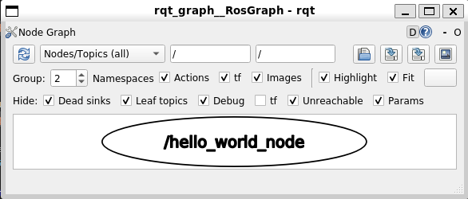

# Introduction to ROS: Practical Tutorial

## Table of Contents
1. [Create a Catkin Workspace](#catkin-workspace)
2. [Create your first package](#create-package)
3. [Hello World program](#hello-world)
4. [Create a ROS node step-by-step](#create-node)
5. [Run and test a node](#run-node)
6. [Create a ROS launch file](#create-launch-file)
7. [Create a subscriber and publisher to a topic](#sub-pub)

---

## 1. Create a Catkin Workspace<a id="catkin-workspace"></a>


Catkin is the ROS build system that manages the compilation and organization of ROS packages. A workspace is a directory where you store and build your ROS packages. In one workspace, you can have multiple packages. A package is a directory that contains ROS-specific files for a ROS node, library, or other ROS-related software. 


<div class="cooked"><h2>
<a name="steps-to-create-a-catkin-workspace-1" class="anchor" href="#steps-to-create-a-catkin-workspace-1"></a>Steps to create a catkin workspace</h2>
<ol>
<li>Open up a terminal.</li>
</ol>
<blockquote>
<p>Shortcut in VsCode: Press <code>CTRL+`</code></p>
</blockquote>
<ol start="2">
<li>
<p>Create the root workspace directory. You can name your directory anything but by ROS convention we will use <code>catkin_ws</code> as the name.</p>
<pre data-code-wrap="sh"><code class="lang-nohighlight">mkdir -p ~/catkin_ws/src
</code></pre>
<ul>
<li>Move to the newly created workspace</li>
</ul>
<pre data-code-wrap="sh"><code class="lang-nohighlight">cd ~/catkin_ws/src
</code></pre>
</li>
<li>
<p>Initialize the catkin workspace.</p>
<pre data-code-wrap="sh"><code class="lang-nohighlight">catkin_init_workspace
</code></pre>

</li>
<li>
<p>Build the workspace.</p>
<ul>
<li>Move back to <code>catkin_ws</code> directory either by…</li>
</ul>
<pre data-code-wrap="sh"><code class="lang-nohighlight">cd  ..
</code></pre>
<p>OR</p>
<pre data-code-wrap="sh"><code class="lang-nohighlight">cd ~/catkin_ws
</code></pre>
<ul>
<li>Finish the creation of the workspace by building it. Note: Build your workspace after every change in C++ scripts. Changes in the Python scripts don’t need rebuilding.</li>
</ul>
<pre data-code-wrap="sh"><code class="lang-nohighlight">catkin_make
</code></pre>
</li>
<li>
<p>Now your catkin workspace will have additional directories <code>build, devel</code>.</p>
<pre data-code-wrap="sh"><code class="lang-nohighlight">ls
</code></pre>
</li>
<li>
<p>Now to make your workspace visible to ROS. Source the setup file in the devel directory.</p>
<pre data-code-wrap="sh"><code class="lang-nohighlight">source ~/catkin_ws/devel/setup.bash
</code></pre>
<p>By doing this, all the packages that you create inside the <code>src</code> folder will be visible to ROS.</p>
</li>
<li>
<p>This <code>setup.bash</code> file of your workspace must be the source every time when you want to use ROS packages created inside this workspace.</p>
<p>To save typing, add this to your <code>.bashrc</code>,</p>
<ol>
<li>
<p><code>gedit ~/.bashrc</code></p>
</li>
<li>
<p>Add to the end: <code>source ~/catkin_ws/devel/setup.bash</code></p>
</li>
<li>
<p>Save and close the editor.</p>
</li>
</ol>
</li>
</ol>


## 2. Create your first package<a id="create-package"></a>

Now, let's create our first ROS package within the Catkin workspace.

```bash
cd ~/catkin_ws/src
```
```bash
catkin_create_pkg my_package rospy
```
- This will create a package named `my_package` with the dependencies `rospy` at `~/catkin_ws/src/`.

## 3. Create a Hello World node<a id="hello-world"></a>

Let's write a simple "Hello World" program in Python to run as a ROS node.

- go to the src directory of your package
```bash
cd ~/catkin_ws/src/my_package/src
```
- create a new file named `hello_world.py` 
```bash
touch hello_world.py
```
- open the file in a text editor - for example, `gedit`
```bash
gedit hello_world.py
```

- write the following code in it

```python
#!/usr/bin/env python3

import rospy

rospy.init_node('hello_world_node')
rospy.loginfo("Hello, ROS!")

rospy.spin()
```


## 5. Run and test a node<a id="run-node"></a>

Let's build and run our ROS node using the `catkin_make` command.

- make the file executable
```bash
chmod +x hello_world.py
```

- go to the root directory of your workspace
```bash
cd ~/catkin_ws
```

- build the workspace
```bash
catkin_make
```

- source the setup file
```bash
source ~/catkin_ws/devel/setup.bash
```

- run the node
```bash
rosrun my_package hello_world.py
```

- you should see the following output
```bash
[INFO] [1634174505.923749]: Hello, ROS!
```

- you can visualize the node in the ROS graph using the `rqt_graph` command
```bash
rqt_graph
```

- you should see the following output


## 6. Create a ROS launch file<a id="create-launch-file"></a>

Instead of runing each command in different terminal, we can create a launch file to run multiple nodes simultaneously.

- go to the launch directory of your package
```bash
cd ~/catkin_ws/src/my_package/launch
```
- or create it
```bash
mkdir ~/catkin_ws/src/my_package/launch
cd ~/catkin_ws/src/my_package/launch
```
- create a new file named `my_launch_file.launch` 
```bash
touch my_launch_file.launch
```
- open the file in a text editor - for example, `gedit`
```bash
gedit my_launch_file.launch
```
- write the following code in it
```bash
<launch>
    <node pkg="my_package" type="hello_world.py" name="hello_world_node" output="screen"/>
    <!-- the following to run rqt_graph -->
    <node pkg="rqt_graph" type="rqt_graph" name="rqt_graph" output="screen"/>
</launch>
```

- go to the root directory of your workspace and create the build files
```bash
cd ~/catkin_ws && catkin_make
```

- source the setup file
```bash
source ~/catkin_ws/devel/setup.bash
```

- run the launch file
```bash
roslaunch my_package my_launch_file.launch
```

## 7. Create a subscriber and publisher to a topic<a id="sub-pub"></a>

Finally, let's create a subscriber and publisher to a topic in ROS.

- go to the src directory of your package
```bash
cd ~/catkin_ws/src/my_package/src
```

- create a script folder to keep your code organized
```bash
mkdir scripts
cd scripts
```

- create a new file named `my_subscriber.py` 
```bash
touch my_subscriber.py
```
- open the file in a text editor - for example, `gedit`
```bash
gedit my_subscriber.py
```
- write the following code in it

```python
#!/usr/bin/env python3

import rospy
from std_msgs.msg import String

def callback(msg):
    rospy.loginfo("Received message: %s", msg.data)

rospy.init_node('my_subscriber')
rospy.Subscriber('my_topic', String, callback)

rospy.spin()
```

- create a new file named `my_publisher.py` 
```bash
touch my_publisher.py
```
- open the file in a text editor - for example, `gedit`
```bash
gedit my_publisher.py
```
- write the following code in it

```python
#!/usr/bin/env python3

import rospy
from std_msgs.msg import String

rospy.init_node('my_publisher')
pub = rospy.Publisher('my_topic', String, queue_size=10)

rate = rospy.Rate(1)  # Publish message once per second

while not rospy.is_shutdown():
    msg = "Hello, ROS!"
    rospy.loginfo(msg)
    pub.publish(msg)
    rate.sleep()
```

- make the files executable
```bash
chmod +x my_subscriber.py
chmod +x my_publisher.py
```

- update your launch file to run the new nodes
```bash
gedit ~/catkin_ws/src/my_package/launch/my_launch_file.launch
```
- delete the old code and write the following code in it

```bash
<launch>
    <node pkg="my_package" type="my_subscriber.py" name="my_subscriber" output="screen"/>
    <node pkg="my_package" type="my_publisher.py" name="my_publisher" output="screen"/>
    <!-- the following to run rqt_graph -->
    <node pkg="rqt_graph" type="rqt_graph" name="rqt_graph" output="screen"/>
</launch>
```

- go to the root directory of your workspace and create the build files
```bash
cd ~/catkin_ws && catkin_make
```

- source the setup file
```bash
source ~/catkin_ws/devel/setup.bash
```

- run the launch file
```bash
roslaunch my_package my_launch_file.launch
```

- you should see the following output
```bash
[INFO] [1634174505.923749]: Hello, ROS!
[INFO] [1634174505.923749]: Received message: Hello, ROS!
```

- see the ROS graph to have a better understanding of the nodes and topics


---

## Now let's play with `Turtlesim` package


